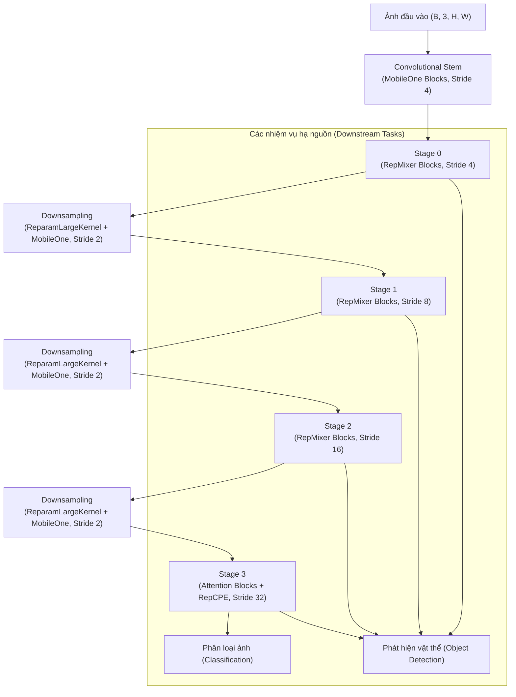
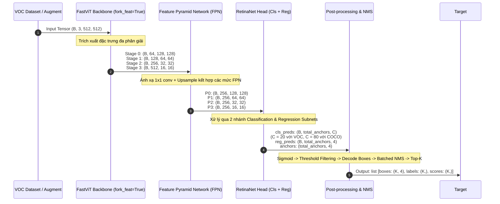
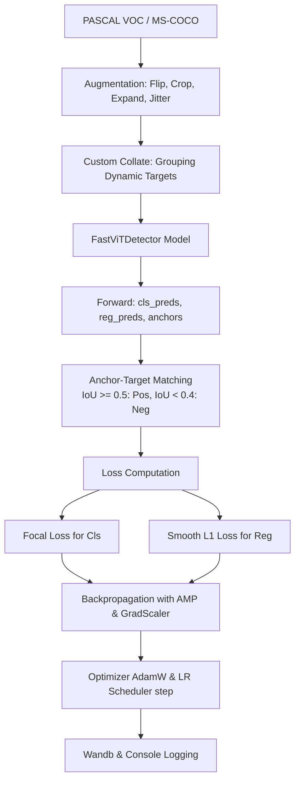
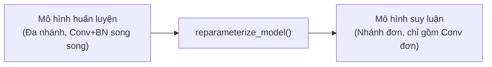
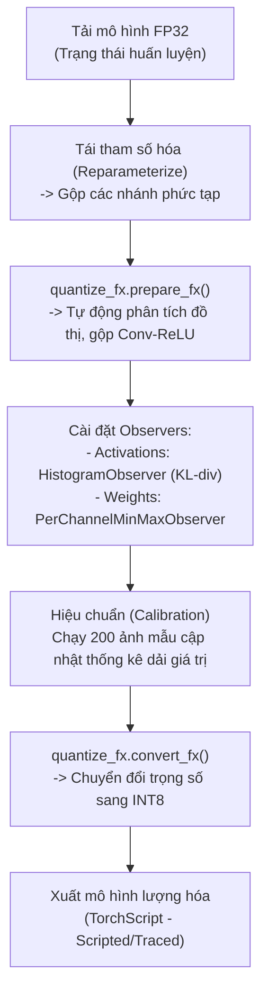

# Kiến Trúc Mô Hình, Luồng Dữ Liệu và Pipeline FastViT

Tài liệu này mô tả chi tiết về kiến trúc mô hình, luồng dữ liệu (Dataflow), các pipeline huấn luyện (Training/Evaluation), quy trình Reparameterization (Tái tham số hóa cấu trúc) và lượng hóa (Quantization) của dự án FastViT.

---

## 1. Kiến Trúc Mô Hình (Model Architecture)

FastViT là một mô hình lai (Hybrid Vision Transformer) kết hợp giữa mạng tích chập (CNN) và Transformer. Thiết kế của FastViT tận dụng thế mạnh về tốc độ và cục bộ (local inductive bias) của CNN ở các stage đầu, kết hợp với khả năng thu nhận thông tin toàn cục (global context) của Self-Attention ở stage cuối. 

Đặc trưng cốt lõi của FastViT là **Structural Reparameterization** (Tái tham số hóa cấu trúc), cho phép mô hình học qua nhiều nhánh song song trong quá trình huấn luyện nhằm tăng độ chính xác, nhưng khi suy luận (inference) sẽ được rút gọn toán học về một nhánh đơn duy nhất nhằm tối ưu hóa độ trễ (latency).

### 1.1 Sơ đồ khối tổng thể của FastViT

### 1.2 Các thành phần cấu trúc cốt lõi

#### A. MobileOne Block (`models/modules/mobileone.py`)
Khối MobileOne được thiết kế với cơ chế huấn luyện đa nhánh (overparameterization).
* **Trong quá trình huấn luyện (Training Mode):** Gồm nhánh tích chập $3 \times 3$ + BN, nhánh $1 \times 1$ + BN, và nhánh Identity + BN.
* **Trong quá trình suy luận (Inference Mode):** Tất cả các nhánh được hấp thụ (absorb) lớp Batch Normalization vào trọng số của Convolution (Conv-BN fusion), sau đó cộng dồn lại về một lớp tích chập đơn lẻ duy nhất (chập $3 \times 3$ hoặc $1 \times 1$).

#### B. RepMixer Block (`models/fastvit.py`)
Là token mixer chính được sử dụng ở Stage 0, 1 và 2 thay thế cho Self-Attention truyền thống giúp giảm đáng kể chi phí tính toán.
* **Nguyên lý:** Sử dụng chập sâu (depthwise convolution) kết hợp với căn chỉnh quy mô kênh (layer scale).
* **Công thức huấn luyện:**
  $$Y = X + \text{layer\_scale} \times (\text{mixer}(X) - \text{norm}(X))$$
  Trong đó, `mixer` và `norm` đều là các khối MobileOne Block.
* **Tái tham số hóa (Reparameterization):** Sau khi `mixer` và `norm` được reparameterize thành các Conv đơn lẻ, nhánh Layer Scale và phép trừ được tích hợp thẳng vào bộ lọc của một lớp tích chập $3 \times 3$ duy nhất:
  $$W_{final} = I_{conv} + \text{LS} \times (W_{mixer} - W_{norm})$$
  $$B_{final} = \text{LS} \times (B_{mixer} - B_{norm})$$
  *(Với $I_{conv}$ là trọng số tích chập đơn vị (identity), $\text{LS}$ là giá trị lớp scale kênh).*

#### C. Attention Block (`models/fastvit.py`)
Được triển khai ở Stage cuối (Stage 3) của các phiên bản **SA** (Self-Attention) như SA12, SA24, SA36 nhằm bắt giữ các mối quan hệ ngữ cảnh xa (long-range dependencies).
* Sử dụng **MHSA (Multi-Headed Self-Attention)** hỗ trợ cả đầu vào dạng tensor 3D hoặc 4D.
* Kết hợp với **RepCPE** (Conditional Positional Encoding có thể tái tham số hóa) ở đầu Stage 3 để nhúng thông tin vị trí không gian một cách linh hoạt.
* Kết hợp với **ConvFFN** (Convolutional Feed-Forward Network) sử dụng tích chập $7 \times 7$ nhóm (grouped) để tăng cường thông tin cục bộ trong FFN.

#### D. PatchEmbed / Downsampling
Thực hiện giảm độ phân giải không gian và tăng số kênh giữa các stage:
* Sử dụng **ReparamLargeKernelConv** (tích chập nhân lớn $7 \times 7$ huấn luyện đa nhánh và rút gọn về tích chập $3 \times 3$ hoặc chập nhỏ khi suy luận) để trích xuất đặc trưng tốt hơn ở ranh giới các vùng phân tách.
* Tiếp nối bởi một lớp **MobileOneBlock** $1 \times 1$ để ánh xạ đặc trưng kênh.

---

### 1.3 So sánh các phiên bản FastViT

Mô hình hỗ trợ nhiều cấu hình khác nhau bằng cách thay đổi số lượng block, số kênh nhúng (embed dims) và loại token mixer:

| Phiên bản | Số lớp (Stages 0-3) | Channels (Stages 0-3) | Token Mixers | Số tham số |
| :--- | :--- | :--- | :--- | :--- |
| **fastvit_t8** | `[2, 2, 4, 2]` | `[48, 96, 192, 384]` | `(repmixer, repmixer, repmixer, repmixer)` | ~4.0M |
| **fastvit_t12** | `[2, 2, 6, 2]` | `[64, 128, 256, 512]` | `(repmixer, repmixer, repmixer, repmixer)` | ~6.8M |
| **fastvit_s12** | `[2, 2, 6, 2]` | `[64, 128, 256, 512]` | `(repmixer, repmixer, repmixer, repmixer)` | ~8.8M |
| **fastvit_sa12** | `[2, 2, 6, 2]` | `[64, 128, 256, 512]` | `(repmixer, repmixer, repmixer, attention)` | ~11.1M |
| **fastvit_sa24** | `[4, 4, 12, 4]` | `[64, 128, 256, 512]` | `(repmixer, repmixer, repmixer, attention)` | ~21.0M |
| **fastvit_sa36** | `[6, 6, 18, 6]` | `[64, 128, 256, 512]` | `(repmixer, repmixer, repmixer, attention)` | ~31.0M |
| **fastvit_ma36** | `[6, 6, 18, 6]` | `[76, 152, 304, 608]` | `(repmixer, repmixer, repmixer, attention)` | ~44.0M |

---

### 1.4 Kiến trúc Object Detection (FastViTDetector)

Mô hình phát hiện vật thể được xây dựng theo kiến trúc một giai đoạn (one-stage detector) tương tự RetinaNet:

1. **Backbone:** FastViT được gọi với tùy chọn `fork_feat=True` để xuất ra các bản đồ đặc trưng đa tỷ lệ từ 4 stage cuối cùng.
2. **FPN (Feature Pyramid Network):**
   * **Lateral Connections:** Sử dụng tích chập $1 \times 1$ để đưa tất cả các đặc trưng từ 4 stage về cùng số kênh trung gian (mặc định là `256`).
   * **Top-down Pathway:** Nội suy lân cận gần nhất (Nearest Neighbor Interpolation) từ mức đặc trưng cao xuống thấp để hợp nhất thông tin ngữ cảnh mức cao với thông tin hình học mức thấp.
   * **FPN Convs:** Các lớp tích chập $3 \times 3$ lọc lại đặc trưng sau khi cộng hợp, tạo ra 4 mức kim tự tháp đặc trưng: `P0, P1, P2, P3` có kích thước không gian lần lượt là $128 \times 128$, $64 \times 64$, $32 \times 32$ và $16 \times 16$ (với đầu vào ảnh $512 \times 512$).
3. **RetinaNet Head:** Gồm 2 nhánh song song dùng chung cho mọi mức kim tự tháp (FPN levels):
    * **Classification Head (Nhánh phân loại):** 4 lớp `Conv3x3 + GroupNorm + ReLU` nối tiếp bởi một lớp tích chập cuối để dự đoán điểm số cho từng lớp (`num_anchors * num_classes`, với `num_classes` là 20 cho VOC hoặc 80 cho COCO). Lớp bias cuối được khởi tạo đặc biệt với xác suất ưu tiên (prior probability $\pi = 0.01$) để hỗ trợ Focal Loss hội tụ nhanh trong giai đoạn đầu huấn luyện.
   * **Regression Head (Nhánh định vị hộp):** 4 lớp `Conv3x3 + GroupNorm + ReLU` nối tiếp bởi lớp tích chập dự đoán khoảng lệch hộp (`num_anchors * 4` ứng với $[t_x, t_y, t_w, t_h]$).

---

## 2. Luồng Dữ Liệu Chi Tiết (Dataflow)

Dưới đây là biểu đồ mô tả luồng biến đổi dữ liệu chi tiết của Tensor từ một bức ảnh đầu vào đi qua hệ thống cho đến kết quả phát hiện vật thể cuối cùng:

### Chi tiết các bước biến đổi trong Post-processing (suy luận):
1. **Tính xác suất:** Áp dụng hàm `sigmoid` lên `cls_preds` để thu được điểm số lớp nằm trong khoảng $[0, 1]$.
2. **Lọc sơ bộ (Pre-filter):** Tìm điểm số lớn nhất trong các lớp của mỗi anchor. Giữ lại các anchor có điểm số vượt quá ngưỡng xác định (ví dụ: `score_thresh = 0.05`).
3. **Giải mã tọa độ hộp (Decode Boxes):** Chuyển đổi khoảng lệch dự đoán $[t_x, t_y, t_w, t_h]$ và tọa độ anchor $[a_x, a_y, a_w, a_h]$ thành tọa độ hộp thực tế $[x_1, y_1, x_2, y_2]$ dựa trên công thức RetinaNet.
4. **Cắt biên (Clip Boxes):** Giới hạn tọa độ các hộp dự đoán trong phạm vi kích thước của ảnh $[0, img\_w]$ và $[0, img\_h]$ để tránh hộp tràn ra ngoài ảnh.
5. **NMS theo lớp (Batched NMS):** Sử dụng hàm NMS song song trên GPU (`batched_nms` từ `torchvision.ops`), dịch chuyển tọa độ các hộp dựa trên ID của lớp để lọc bỏ các hộp trùng lặp của cùng một vật thể mà không làm ảnh hưởng đến các lớp khác nhau.
6. **Lọc số lượng tối đa (Top-K):** Giữ lại tối đa $N$ vật thể tốt nhất (mặc định: `max_detections = 200`) để trả về kết quả cuối cùng.

---

## 3. Pipelines & Quy Trình Hoạt Động (Workflows)

### 3.1 Pipeline Huấn luyện Phát hiện Vật thể (Object Detection Pipeline)

Được điều phối chủ yếu qua file `object_detection.py`, luồng huấn luyện được thiết lập như sau:

* **Data Augmentation:** Áp dụng các phép biến đổi hình học và màu sắc an toàn cho bài toán phát hiện vật thể (tọa độ các bounding boxes được tính toán và biến đổi đồng thời với ảnh):
  * **Lật ngang ngẫu nhiên (Horizontal Flip):** Xác suất 50%.
  * **Biến đổi màu sắc (Color Jitter):** Thay đổi ngẫu nhiên độ sáng, độ tương phản, độ bão hòa màu và sắc thái với xác suất 50%.
  * **Phóng to ngẫu nhiên (Random Expand):** Thu nhỏ ảnh gốc và chèn vào một nền màu trung bình ngẫu nhiên để mô phỏng vật thể ở xa (xác suất 50%).
  * **Cắt ảnh ngẫu nhiên (Random Crop):** Cắt một vùng ảnh dựa trên chỉ số IoU và đảm bảo trọng tâm của ít nhất một vật thể gốc nằm trong vùng cắt.
  * **Chuẩn hóa kích thước (Resize):** Resize đồng loạt về kích thước $512 \times 512$ và chuẩn hóa theo giá trị trung bình/phương sai của ImageNet.
* **Tách nhóm Optimizer (Weight Decay Groups):**
  * Tách biệt các tham số cần Weight Decay (các ma trận trọng số trong Linear và Conv) và các tham số không cần Weight Decay (biases, Batch Normalization parameters, Layer Scales).
  * Đặt tốc độ học (Learning Rate) của Backbone chỉ bằng 10% tốc độ học của Detection Head để bảo toàn các đặc trưng đã được tiền huấn luyện (pretrained features).
* **Quản lý tốc độ học (LR Schedule):** Sử dụng bộ lập lịch kết hợp giữa **Linear Warmup** (5 epoch đầu tăng dần từ 0 đến LR định nghĩa) và **Cosine Annealing** (giảm dần theo hàm cosine về giá trị nhỏ nhất `1e-6`).

---

### 3.2 Pipeline Tái tham số hóa (Reparameterization Pipeline)

Quy trình reparameterization đóng vai trò then chốt giúp tối ưu mô hình trước khi triển khai hoặc lượng hóa:

1. **Khớp nối tích chập và BN (Conv-BN Fusion):**
   Với một lớp chập có trọng số $W$, bias $b$ và lớp Batch Normalization có các tham số $\mu, \sigma^2, \gamma, \beta$:
   Trọng số và bias mới sau khi dung hợp được tính như sau:
   $$W_{fused} = W \times \frac{\gamma}{\sqrt{\sigma^2 + \epsilon}}$$
   $$b_{fused} = (b - \mu) \times \frac{\gamma}{\sqrt{\sigma^2 + \epsilon}} + \beta$$
2. **Gộp các nhánh song song (Branch Fusion):**
   Vì các phép toán tích chập có tính chất tuyến tính, các lớp chập song song có cùng kích thước bộ lọc (hoặc được đệm/pad về cùng kích thước) có thể được cộng trực tiếp trọng số và bias lại với nhau:
   $$W_{merged} = W_{3\times3} + \text{pad}(W_{1\times1}) + \text{pad}(W_{identity})$$
   $$b_{merged} = b_{3\times3} + b_{1\times1} + b_{identity}$$
3. Lặp lại quá trình này trên toàn bộ mạng (cho các khối MobileOneBlock, RepMixer, RepCPE, ReparamLargeKernelConv) để tạo ra mô hình dạng chuỗi các lớp Conv-ReLU tuyến tính đơn giản nhất có thể.

---

### 3.3 Pipeline Lượng hóa (Quantization Pipeline)

Được triển khai trong `quantize.py`, hỗ trợ chuyển đổi mô hình từ số thực dấu phẩy động 32-bit (FP32) sang số nguyên 8-bit (INT8) để chạy cực nhanh trên CPU:

* **Reparameterize trước khi lượng hóa:** Đây là bước cực kỳ quan trọng. Việc loại bỏ các nhánh song song trước khi lượng hóa giúp đồ thị tính toán gọn gàng hơn, giảm thiểu lỗi phân tích đồ thị và giảm suy hao độ chính xác đáng kể.
* **FX Graph Mode:** Sử dụng công cụ đồ thị tiên tiến của PyTorch giúp tự động phát hiện và tối ưu cấu trúc mạng thay vì phải định nghĩa thủ công các khối Stub.
* **Observers chuyên biệt:**
  * **HistogramObserver (cho Activations):** Thu thập phân phối giá trị kích hoạt qua tập hiệu chuẩn và sử dụng thuật toán tối thiểu hóa độ lệch KL (Kullback-Leibler divergence) để tìm ngưỡng cắt tối ưu, chống nhiễu ngoại lai (outliers).
  * **PerChannelMinMaxObserver (cho Weights):** Tính toán dải lượng hóa riêng biệt cho từng kênh đầu ra của lớp tích chập, giúp giữ lại độ chính xác cực cao của các bộ lọc đặc trưng.
* **Xuất mô hình:** Hỗ trợ lưu trữ dưới dạng TorchScript thông qua cơ chế `script` (giữ nguyên luồng điều khiển) hoặc `trace` (chạy thử với dữ liệu ảo) để triển khai trên môi trường sản xuất không phụ thuộc vào Python.
